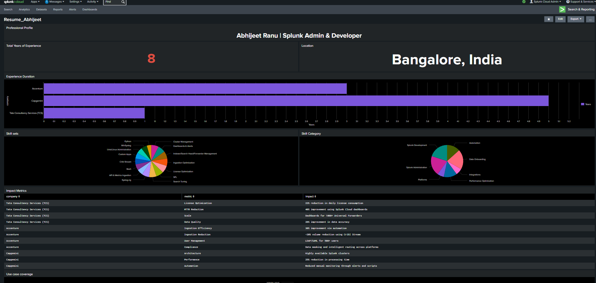
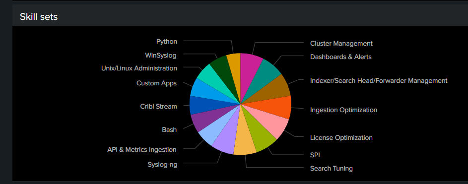
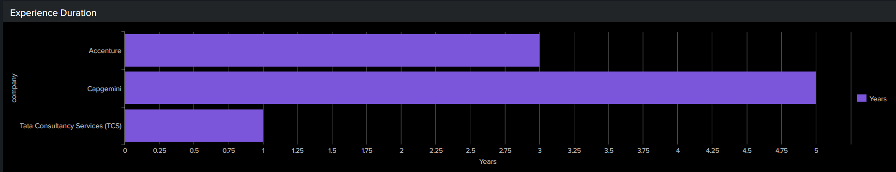

# Splunk Resume Dashboard (Classic)

This project demonstrates how structured resume data can be transformed into an interactive Splunk Classic dashboard.

## Dashboard Highlights
- Executive KPIs (experience, role, location)
- Skills distribution with SPL-driven percentages
- Career timeline by company
- Quantified business impact and achievements
- Use-case coverage across enterprises

## Technology Stack
- Splunk Enterprise / Splunk Cloud
- Classic Dashboards (Simple XML)
- SPL, spath, mvexpand
- JSON data modeling

## Screenshots

## Files Included
- `dashboard/resume_dashboard.xml` – Classic dashboard XML
- `spl/` – Individual SPL queries
- `data/resume_sample.json` – Sample resume data
- `pdf/` – Exported dashboard for offline viewing

## Notes
Live Splunk access is not provided due to licensing constraints.  
The PDF and XML represent the production-ready dashboard.

## Author
Abhijeet Ranu  
Splunk Admin & Developer (8+ years)
